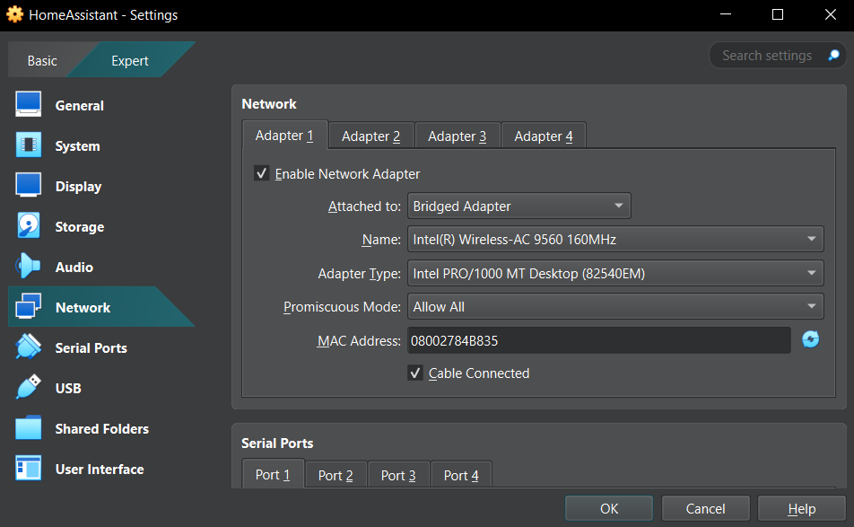
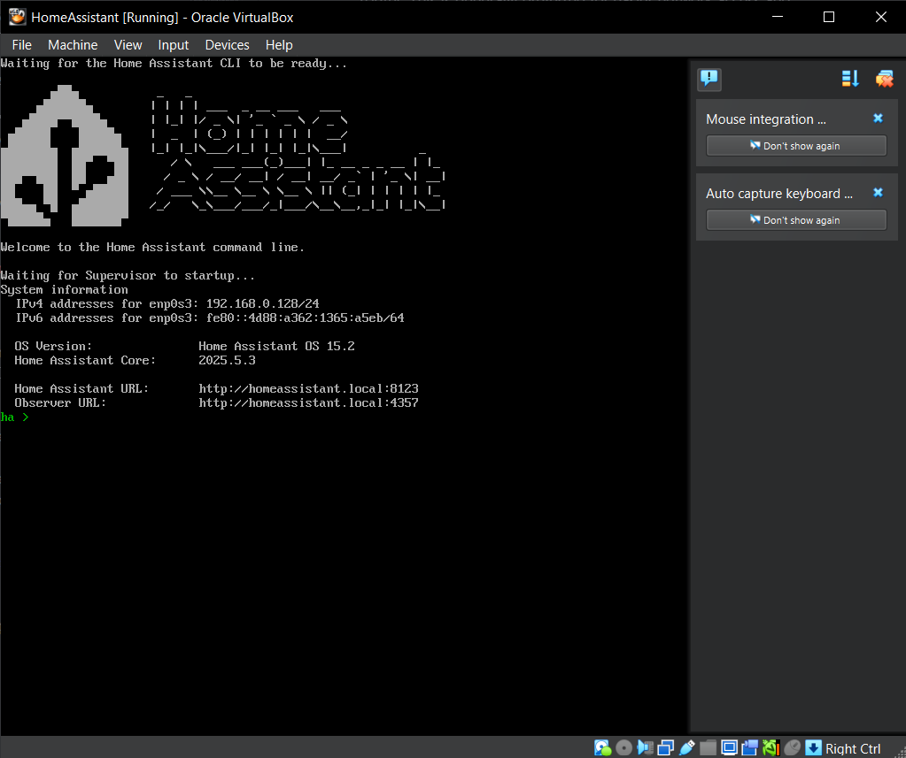
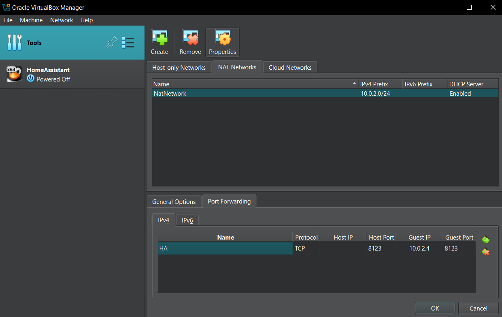
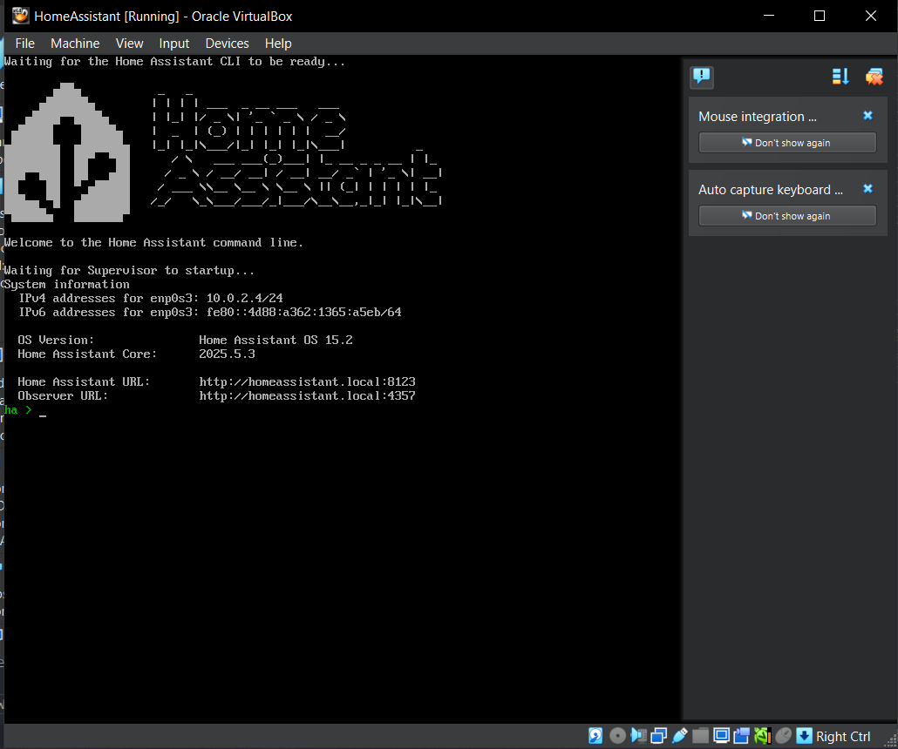
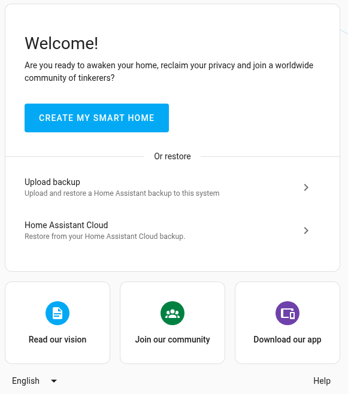

## 1. Setting up Home Assistant on VirtualBox VM
Installation instructions can be found on the Home Assistant installation pages for [Windows](https://www.home-assistant.io/installation/windows) or [Linux](https://www.home-assistant.io/installation/linux).
### 1.1 Download Necessary Files

First, you'll need two main components:

*   **Oracle VirtualBox:** Download and install VirtualBox.
*   **Home Assistant OS Virtual Disk Image (VDI):** Download the VirtualBox image from the official Home Assistant website (`.vdi` file).

### 1.2 Create a New Virtual Machine for Home Assistant

After installing VirtualBox, create a new VM for Home Assistant.

1.  **Extract the Home Assistant OS VDI**
   If the downloaded Home Assistant OS image is a `.zip` file, extract the `.vdi` file.
2.  **Create new virtual machine**
    1.  Type: "Linux"
    2.  Version: "Other Linux (64-bit)"
    3.  Hardware: at least 2GB RAM and at least 2 CPU
    4.  Enable EFI
    5.  Hard Disk: "Use an existing virtual hard disk file" and select the `.vdi` file.

### 1.4 Configure Virtual Machine Settings

Before starting the VM, some settings needs to be adjusted.

1.  **Audio Settings:**
    *   Go to the **"Audio"** tab.
    *   Select **"Intel HD Audio"** as the Audio Controller.

2.  **Network Settings (Choose one method):**

    #### Method A: Bridged Adapter

    This method makes your Home Assistant VM appear as a separate device on your network, getting its own IP address directly from your router. This is generally preferred for easier network access and discovery, however may not work due to router settings.
    1.  Go to the "Network" settings in the Home Assistant VM. For Adapter 1, set "Attached to" to "Bridged Adapter", Allow All for Promiscous Mode.
    
    2. After runnong the VM, you should see ipv4 address. Check network settings inside the VM console with `network info`. ipv4 method should be auto. You can change it with `network update enp0s3 --ipv4-method auto`, then `network reload`
    

    #### Method B: NAT with Port Forwarding

    This method allows the VM to access the internet through your host machine's network address translation. To access Home Assistant from other devices on your network or externally, you'll need to set up port forwarding.

    3.  Go to the "Tools" tab and create new NAT network.
    
    Create a Port Forwarding rule: leave the Host Ip blank, Host port 8123, Guest IP 10.0.2.4 (can be different), Guest Port 8123.
    4.  Go to the "Network" settings in the Home Assistant VM. For Adapter 1, set "Attached to:" to "NAT", Allow All for Promiscous Mode.
    5. After runnong the VM, you should see ipv4 address, make sure it is the same as Guest Ip in the port forwarding rule.
    
    

### 1.5 Onboarding to Home Assistant
Now with the VM running, register at http://homeassistant.local:8123/ or `http://<IP_ADDRESS>.local:8123/`.
    
