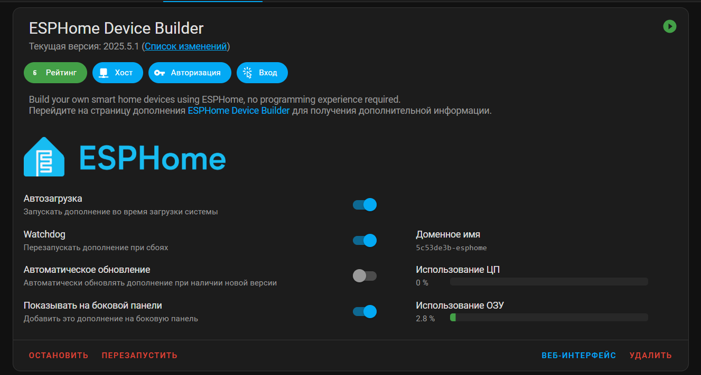
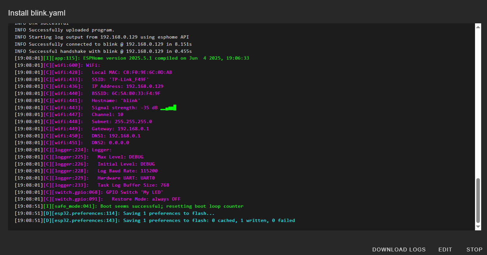
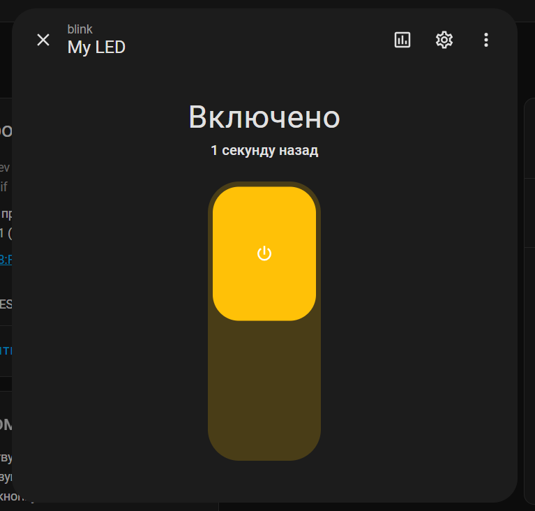

## 2. Integrating ESPHome with Home Assistant

This section guides you through setting up ESPHome within Home Assistant, uploading initial firmware, and then updating it wirelessly.

### 2.1 Installing the ESPHome Add-on

First, you need to install the ESPHome builder add-on within your Home Assistant instance.

1.  **Access Home Assistant UI:** Open your Home Assistant dashboard in a web browser (e.g., `http://homeassistant.local:8123/`).
2.  **Navigate to Add-ons:** From the sidebar, go to **Settings** > **Add-ons**.
3.  **Open Add-on Store:** Click the **"Add-on Store"** button in the bottom right corner.
4.  **Search for ESPHome:** In the search bar, type "ESPHome" and select the official ESPHome add-on and install it.
     
5.  **Start and Configure:** Once installed, ensure the "Start on boot" and "Watchdog" options are enabled for reliability. Then, click **"START"**. For easier access, enable **"Show in sidebar"**.

### 2.2 Initial Firmware Upload via USB using web.esphome.io

To enable wireless (Over-The-Air - OTA) updates, you first need to flash a basic ESPHome firmware to your ESP device via a USB connection.

**Prerequisites:**

*   **USB Cable:** A functional USB cable connecting your ESP device to your computer.
*   **Compatible Browser:** Google Chrome or Microsoft Edge browser (these support the Web Serial API required for web.esphome.io).
*   **ESP Device:** Your ESP32 or ESP8266 development board.

**Steps:**


1. Go to **ESPHome Device builder**. First, add your wifi network to the **SECRETS** in the top right corner.
    ```yaml
        wifi_ssid: "Your_WiFi_SSID"
        wifi_password: "Your_WiFi_Password"
    ```
2. Then create new device. Follow the instructions. When promted to install, choose **Plug into this computer** for first install.
3. **Open web.esphome.io:** In your compatible browser, navigate to [web.esphome.io](https://web.esphome.io/).
4.  **Connect to Device:** Click the **"CONNECT"** button. A pop-up will appear, listing available serial ports. Choose the serial port corresponding to your ESP device.
5.  Once connected, choose **INSTALL** and upload `.bin` file with the firmware generated by ESPHome Device Builder. After succesfull installation, ESPHome webapp will attempt to connect to the device.
6.  If the connection was succesfull, you should see a new device in **Settings** > **Devices & Services**.

If there were problems with conection, you may need to add esps ip address to the configuration mannually.
To do this, click **EDIT** to change the .yaml configuration, add wifi settings:
```yaml
    wifi:
      ssid: !secret wifi_ssid
      password: !secret wifi_password

      manual_ip:
        static_ip: 192.168.0.129 # <--- Set your desired static IP
        gateway: 192.168.0.1    # <--- Your router's IP
        subnet: 255.255.255.0   # <--- Your network's subnet mask
        dns1: 192.168.0.1       # <--- Your DNS server (often your router's IP)
```

Now that the device is configured, you can modify its firware and upload changes wirelessly.

### 2.4 Modifying Firmware
Now ypu can add functionallity to the ESP device. For instance, this is how to set up a LED switch.
1.  **Edit Device Configuration:** In the ESPHome dashboard, find the device you just added. Click the **"EDIT"** button next to its name. This will open its YAML configuration file.
2.  **Add LED Switch:**
    Now, modify your device's YAML configuration. Add  the `switch:` block for the LED as shown below. Common pins for built-in LEDs are `GPIO2`.
    ```yaml
    switch:
      - platform: gpio
        pin: GPIO2 # <--- Change this to your LED's GPIO pin
        name: "My LED"
    ```
3.  **Upload Wirelessly (OTA):**
    *   Back in the ESPHome dashboard, find your device.
    *   Click the **"INSTALL"** button.
    *   From the dropdown, select **"Wireless"**.
    *   ESPHome will now compile the new firmware and upload it wirelessly to your ESP device. This process involves compilation time (which depends on your Home Assistant VM's resources) and then the actual OTA upload. Monitor the log output for progress.
     
4.  **Verify in Home Assistant:**
    *   Once the wireless upload is complete and successful, go back to your Home Assistant UI.
    *   Navigate to **Settings** > **Devices & Services** > **Devices**.
    *   Find your ESP device. You should now see the "My LED" switch entity.
    *   Toggle the switch in Home Assistant, and you should see the LED on your ESP board turn on and off!
    