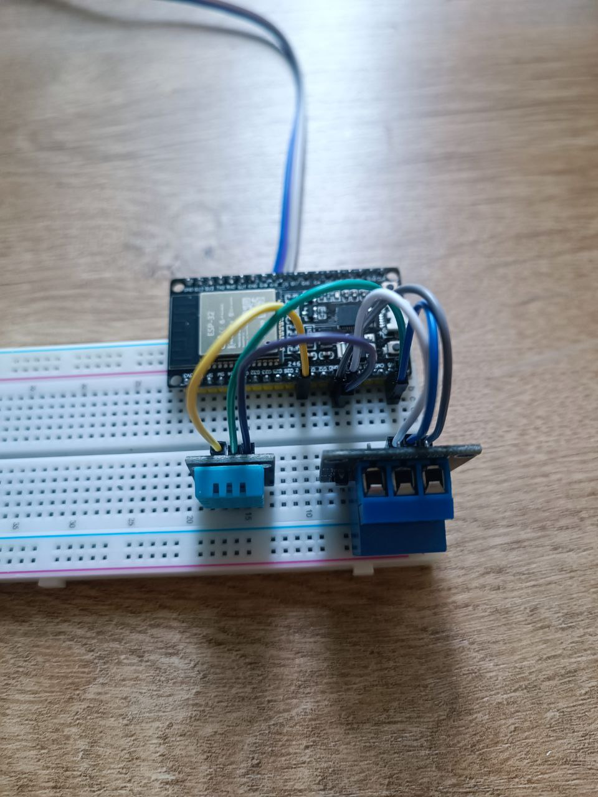
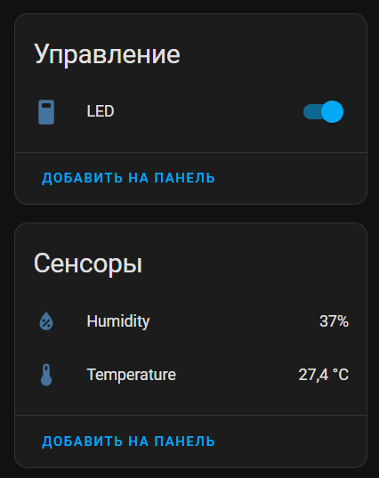

Okay, here is the content for a separate file named 3. ESPHome fan automation.md:

# 3. ESPHome Fan Automation

This section guides you through implementing an automated fan control system on your ESPHome device using a DHT11 temperature sensor and a relay module. The fan will automatically turn on when the temperature rises above a certain threshold and turn off when it falls below another.

### Hardware Connections (Wiring)

Before modifying the firmware, ensure your DHT11 sensor and relay module are correctly wired to your ESP board.

*   **DHT11 Temperature & Humidity Sensor:**
    *   **VCC:** Connect to 5V pin on your ESP board.
    *   **GND:** Connect to a GND pin on your ESP board.
    *   **Data (Sig/Out):** Connect to any free GPIO on your ESP board. Check if this GPIO is available here [ESP32 Pinout](https://randomnerdtutorials.com/esp32-pinout-reference-gpios/)

*   **Relay Module (for Fan Control):**
    *   **VCC:** Connect to 5V on your ESP board.
    *   **GND:** Connect to a GND pin on your ESP board.
    *   **IN (Signal):** Connect to any free GPIO on your ESP board.



### Implementing Automated Fan Control

Now that your hardware is connected, you can configure your ESP device's firmware to read temperature and control the fan.

**Steps:**

1.  **Edit Device Configuration:**
    *   Open your Home Assistant UI.
    *   Navigate to the **ESPHome Add-on**.
    *   In the ESPHome dashboard, find your ESP device.
    *   Click the **"EDIT"** button next to its name. This will open its YAML configuration file in the editor.

2.  **Add Fan Switch and DHT11 Sensor Configuration:**
    Add the `switch:` block for the fan and the `sensor:` block for the DHT11 sensor to your device's YAML configuration. Ensure correct indentation. If you already have a `switch:` block (e.g., for an LED), just add the new `platform: gpio` entry under it.

    ```yaml
    # --- Add Relay Control ---
    switch:
      - platform: gpio
        name: "FAN"
        pin: GPIO13  # <--- Pin connected to the Relay's IN terminal
        id: fan      # <--- A unique ID for referring to this switch later

    # --- Add DHT11 sensor ---
    sensor:
      - platform: dht
        pin: GPIO27  # <--- Pin connected to the DHT11's Data line
        temperature:
          name: "Temperature"
          on_value_range:
            - above: 26.0  # <--- If temperature goes above 26.0°C
              then:
                - switch.turn_on: fan # <--- Turn on the fan (using its 'id')
            - below: 22.0  # <--- If temperature goes below 22.0°C
              then:
                - switch.turn_off: fan # <--- Turn off the fan
        humidity:
          name: "Humidity"
        update_interval: 60s # <--- Read sensor every 60 seconds
    ```
3.  **Upload Wirelessly (OTA):**
    *   After saving your YAML changes in the ESPHome editor, go back to the ESPHome dashboard.
    *   Find your device.
    *   Click the **"INSTALL"** button.
    *   From the dropdown, select **"Wireless"**.
    *   ESPHome will now compile the new firmware and upload it wirelessly to your ESP device. This process involves compilation time (which depends on your Home Assistant VM's resources) and then the actual OTA upload. Monitor the log output for progress.

4.  **Verify in Home Assistant:**
    *   Once the wireless upload is complete and successful, go back to your Home Assistant UI.
    *   Navigate to **Settings** > **Devices & Services** > **Devices**.
    *   Find your ESP device. You should now see new entities associated with it: the "FAN" switch, "Temperature" sensor, and "Humidity" sensor.
    *   You can manually toggle the "FAN" switch in Home Assistant to test the relay and fan connection.
    *   The fan will now automatically react to temperature changes in its environment!


