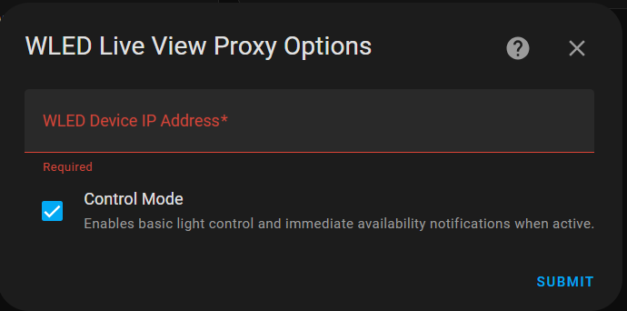

# WLED Timer Animation Automation

This section guides you through creating an animation on your WLED device that visualizes a countdown timer in Home Assistant. This is achieved by using the WLED Liveview Proxy integration to send real-time pixel data to a WLED device based on the remaining time of a Home Assistant timer.

---

### Prerequisites

Before you begin, ensure you have the following set up:

* **Home Assistant:** A running instance of Home Assistant.
* **WLED Device:** A WLED-enabled device (e.g., an ESP32 with addressable LEDs) connected to your network and configured with WLED firmware.

---

### 1. Install HACS (Home Assistant Community Store)
Instuctions to install [HACS](https://www.hacs.xyz/docs/use/download/download/#to-download-hacs)

### 2. Install WLED Liveview Proxy Integration

This custom integration allows Home Assistant to send pixel-level commands to your WLED device.

**Steps:**

 * **Navigate to HACS:** In Home Assistant, go to `HACS` in the sidebar.
 * **Go to Integrations:** Click on `Integrations`.
 * **Explore & Download Repositories:** Click on the three dots in the top right corner, then select `Custom repositories`.
 * **Add WLED Liveview Proxy Repository:**
    * **Repository URL:** `https://github.com/danishru/wled_liveviewproxy`
    * **Category:** `Integration`
    * Click `ADD`.
 * **Search for WLED Liveview Proxy:** Go back to the HACS Integrations page and search for "WLED Liveview Proxy".
 * **Download the Integration:** Click on the "WLED Liveview Proxy" integration and then click `Download`.

### 3. Add WLED Device to Home Assistant

Once WLED Liveview Proxy is installed, you can add your WLED device as an integration.

**Steps:**

1.  **Go to Devices & Services:** In Home Assistant, navigate to `Settings` > `Devices & Services`.
2.  **Add Integration:** Click on `+ Add Integration`.
3.  **Search for WLED Liveview Proxy:** Search for "WLED Liveview Proxy".
4.  **Configure the Integration:**
    * You will be prompted to enter the IP address of your WLED device. Enter it and enable the control mode.
    *  

### 4. Create a timer
Go to `Settings` > `Devices & Services` > `Helpers` > `Create Helper` > `Timer` and create a new timer. Give it a name `wled_countdown` and some duration (e.g. 5 minutes).

### 5. Create the WLED Timer Animation Automation

**Steps:**

1.  **Navigate to Automations:** In Home Assistant, go to `Settings` > `Automations & Scenes` > `Automations`.
2.  **Create New Automation:** Click on `+ Create Automation`.
3.  **Switch to YAML Mode:** In the top right corner, click on the three dots and select `Text editor`.
4.  **Paste the Automation Code:** Replace the existing content with the following YAML code. **Replace `YOUR_WLED_DEVICE_ID` with the actual device ID of your WLED device.**

    ```yaml
    alias: WLED timer animation
    description: ""
    trigger:
      - platform: state
        entity_id:
          - timer.wled_countdown
        to: active
    condition: []
    action:
      - repeat:
          sequence:
            - variables:
                duration_str: >-
                  {{ state_attr('timer.wled_countdown', 'duration') |
                  default('0:00:00', true) }}
                duration_parts: "{{ duration_str.split(':') }}"
                duration_seconds: >-
                  {{ duration_parts[0] | int * 3600 + duration_parts[1] | int * 60 +
                  duration_parts[2] | int }}
                finishes_at_timestamp: "{{ state_attr('timer.wled_countdown', 'finishes_at') }}"
                remaining_seconds: |-
                  
                    {{ (as_timestamp(finishes_at_timestamp) - as_timestamp(now())) | round(0, 'ceil') }}
                  
                    0
                  
                pixels_total: 24 # Adjust this to the total number of LEDs on your strip
                lit_pixels: |
                  
                    {{ (remaining_seconds / duration_seconds * pixels_total) | int }}
                  
                    0
                  
            - action: wled_liveviewproxy.send_command
              metadata: {}
              data:
                targets:
                  device_id: YOUR_WLED_DEVICE_ID
                command:
                  seg:
                    - id: 0
                      start: 0
                      stop: "{{ pixels_total }}"
                      col:
                        - 0
                      fx: 0
                      bri: 255
                    - id: 0
                      start: 0
                      stop: "{{ lit_pixels }}"
                      col:
                        - 00ff00 # Green
                      fx: 0
                      bri: 100
              response_variable: response
          until:
            - condition: state
              entity_id: timer.wled_countdown
              state: idle
      - if:
          - condition: state
            entity_id: timer.wled_countdown
            state: idle
        then:
          - action: wled_liveviewproxy.send_command
            metadata: {}
            data:
              command:
                seg:
                  - id: 0
                    start: 0
                    stop: "{{ pixels_total }}"
                    col:
                      - 0
                    fx: 0
                    bri: 255
              targets:
                device_id: YOUR_WLED_DEVICE_ID
            response_variable: response
    mode: single
    ```

---

### How the Automation Works

This automation is triggered when your `timer.wled_countdown` changes to an `active` state. It then enters a `repeat` loop that continues until the timer becomes `idle`.

Inside the loop:

1.  **Variables Calculation:**
    * It calculates the total duration of the timer and the remaining time in seconds.
    * `pixels_total` is set to the total number of LEDs on your strip.
    * `lit_pixels` is calculated based on the ratio of `remaining_seconds` to `duration_seconds`, determining how many LEDs should be lit to represent the remaining time.
2.  **WLED Command:**
    * It sends a `wled_liveviewproxy.send_command` service call.
    * This command consists of two segments (`seg`):
        * The first segment sets all pixels to black (off).
        * The second segment then lights up a certain number of pixels (`lit_pixels`) from the beginning of the strip in green (00ff00) with a brightness of 100.
3.  **Loop Condition:** The `repeat` loop continues until the `timer.wled_countdown` entity changes its state to `idle`, meaning the timer has finished.
4.  **Timer Finished Action:** Once the timer finishes, the `if` condition triggers, sending a final command to the WLED device to turn all pixels off, ensuring a clean state after the countdown.