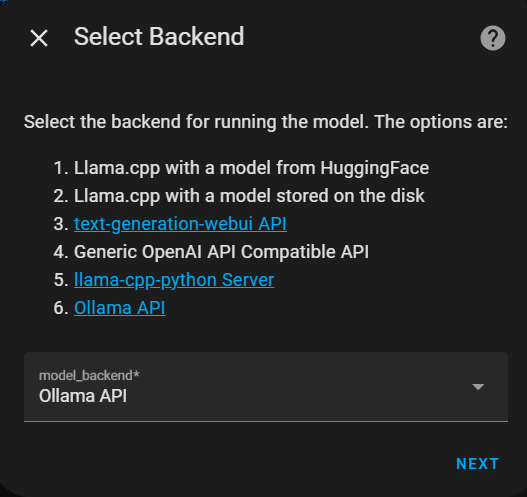
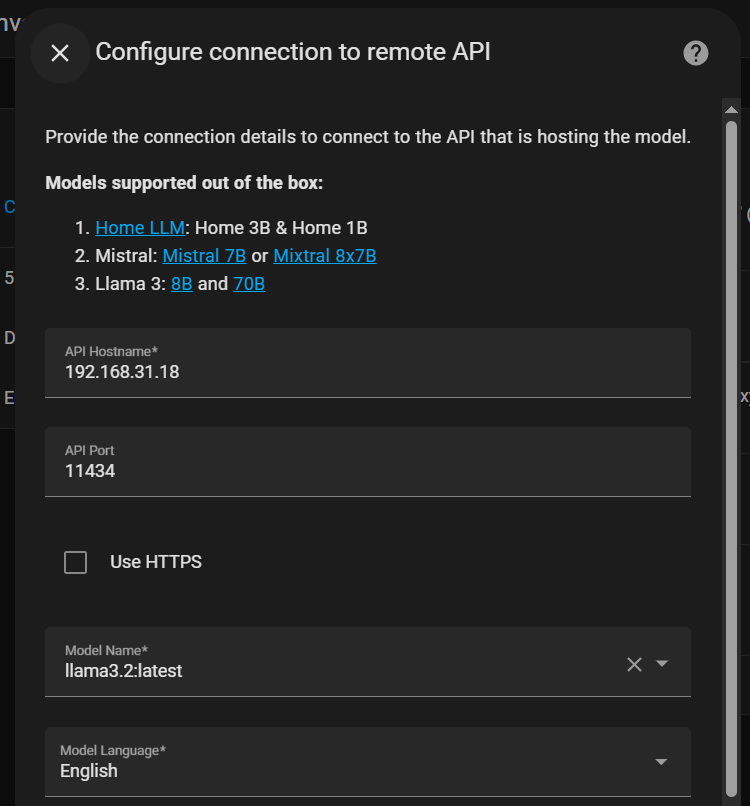
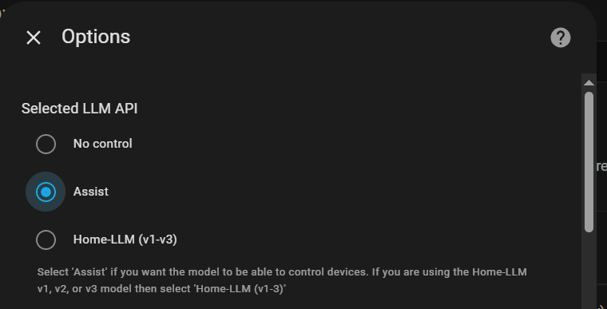
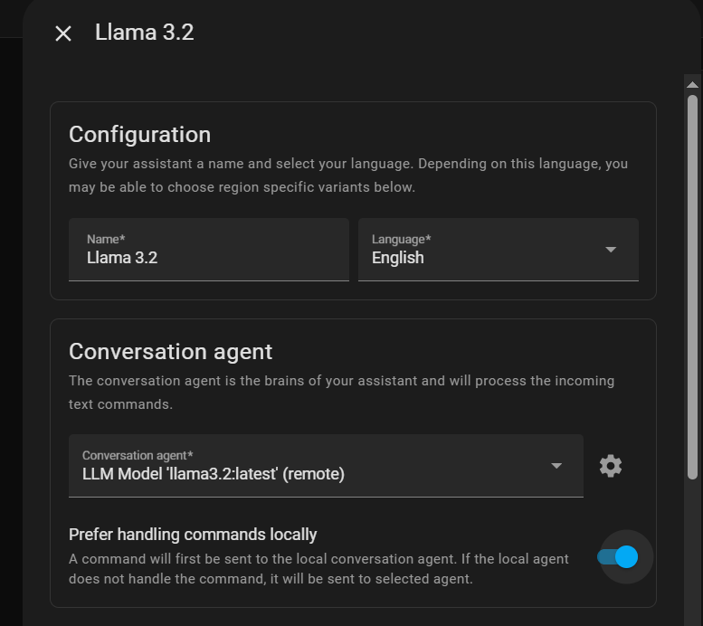
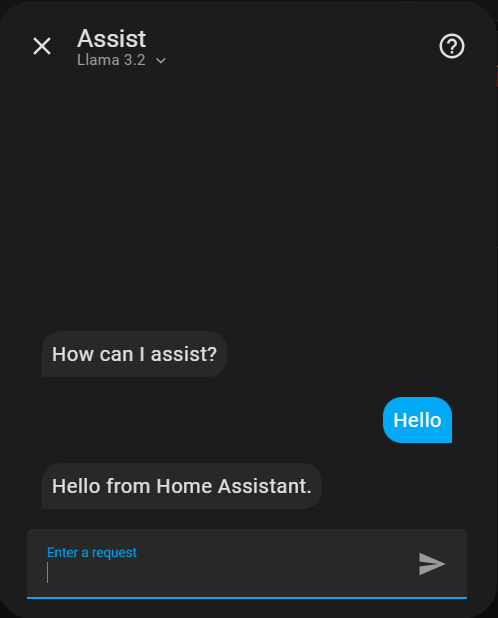

## Setting Up a Local LLM with Assist in Home Assistant

This guide explains how to enhance Home Assistant's Assist feature with a locally-hosted Large Language Model (LLM). This setup provides a private, fast, and highly capable voice assistant that can handle complex queries beyond simple commands.

### 1. Understanding the Assist LLM Pipeline

When you use voice to interact with this setup, your request goes through a multi-step process called a "pipeline":

1.  **Speech-to-Text (STT):** Spoken words are captured and transcribed into text with [Whisper](https://my.home-assistant.io/redirect/supervisor_addon?addon=core_whisper).
2.  **Intent Recognition:** Home Assistant first tries to match the text to a local command (e.g., "Turn on the living room lights"). This is fast and efficient for controlling your devices.
3.  **LLM Fallback:** If the text is not a direct command, it's passed to the external LLM for a more conversational or knowledge-based response (e.g., "What are some good ideas for a high-protein breakfast?"). **Local LLM Conversation** integration is used for this. [Setup Guide](https://github.com/acon96/home-llm/blob/develop/docs/Setup.md)
4.  **Text-to-Speech (TTS):** The LLM's text response is converted back into spoken audio using [Piper add-on.](https://my.home-assistant.io/redirect/supervisor_addon?addon=core_piper)

This hybrid approach gives the best of both worlds: immediate local control and advanced conversational AI.

### 2. Setting Up the Local Language Model (Ollama)

[Ollama](https://ollama.com/) is an application that allows you to run powerful LLMs like Llama 3.2 on your hardware.

 - Download the Llama 3.2 Model
```bash
ollama pull llama3.2
```
 - Expose Ollama to the network
  By default, Ollama only responds to requests from the same machine. To allow Home Assistant to connect to it, it needs to be exposed to the local network. To do this, add enviroment variable `OLLAMA_HOST` with value `0.0.0.0`.

### 3. Configuring the LLM Integration
Add **Local LLM Conversation** integration. In settings, choose ollama backend, fill in the ip address and select `Assist` API.





### 5. Configuring the Final Assist Pipeline

With all the components installed, now create a new voice assistant pipeline.

1.  **Settings > Voice assistants**
2.  **Add Assistant**
3.  Configure the pipeline as follows:
    *   **Speech-to-text:** `Whisper`
    *   **Conversation agent:** `LLM Model 'llama3.2:latest' (remote)`
    *   **Text-to-speech:** `Piper`
4.  **Save** or **Create**.



### 6. Testing Your New Assistant

